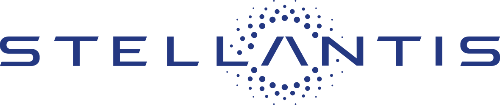
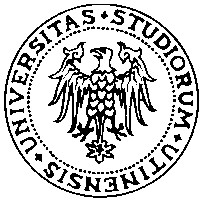
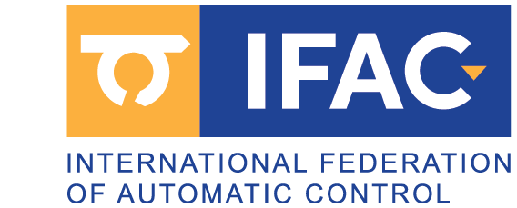

[Download PDF](data/MattiaPiazzaCVEng.pdf){.btn .btn-outline-primary role="button"}

## Key qualifications

::: {.entry-list}

::: {.entry}
::: {.entry-icon}

:::

::: {.entry-body}
[PhD in Systems Engineering]{.entry-title} — Research on optimal control and lap-time simulation for racing applications.
:::
:::

::: {.entry}
::: {.entry-icon}

:::

::: {.entry-body}
[4+ years experience]{.entry-title} — Motion planning, optimal control, and vehicle and autonomous agent dynamics.
:::
:::

::: {.entry}
::: {.entry-icon}

:::

::: {.entry-body}
[Vehicle dynamics]{.entry-title} — Custom multi-body models and controls for OEMs and motorsport.
:::
:::

::: {.entry}
::: {.entry-icon}

:::

::: {.entry-body}
[Programming proficiency]{.entry-title} — Extensive use of C++, MATLAB and Python for algorithm and tool development.
:::
:::

::: {.entry}
::: {.entry-icon}

:::

::: {.entry-body}
[Software engineering]{.entry-title} — Experienced with Git and cross-platform development workflows.
:::
:::

::: {.entry}
::: {.entry-icon}

:::

::: {.entry-body}
[International collaboration]{.entry-title} — Experience in European, national, and OEM-funded projects.
:::
:::

:::

## Working experience

::: {.entry-list}

::: {.entry}

::: {.entry-body}
[PhD Researcher — Doctoral program in Mechatronics and Systems Engineering]{.entry-title}\
University of Trento, IT\
Motion planning algorithms for autonomous driving, multiagent cooperation and racing scenarios. Multiplatform real-time control library. MLT simulator for MotoGP with indirect optimal control methods.\
[2022 – present]{.entry-meta}
:::
:::

::: {.entry}

::: {.entry-body}
[Visiting Researcher — Autonomous Vehicle Systems Laboratory]{.entry-title}\
Technische Universität München (TUM), DE\
Velocity profile online optimization for the Indy Autonomous Challenge (IAC) and Abu Dhabi Autonomous Racing League (A2RL). Time-optimal velocity planning and control under dynamic grip constraints.\
[2025 – present]{.entry-meta}
:::
:::

::: {.entry}

::: {.entry-body}
[Research Fellowship]{.entry-title} (Research grant decree n. 205/2020)\
University of Trento, IT — Solution algorithms comparison for minimum-time optimal control problems for racing vehicles.\
[2021 – 2022]{.entry-meta}
:::
:::

::: {.entry}

::: {.entry-body}
[Research Scholarship]{.entry-title} (Decree n. 74/2020)\
University of Trento, IT — Minimum Time Manoeuvres of complex vehicle models described with DAEs.\
[2020 – 2021]{.entry-meta}
:::
:::

:::

## Projects

::: {.entry-list}

::: {.entry}

::: {.entry-body}
[VeDi 2025]{.entry-title} — *Ministero Italiano dello Sviluppo Economico*\
CRF – Stellantis | University of Trento\
Development of a motion planner for maneuver negotiation between AVs via V2X communication.\
[2022 – 2024]{.entry-meta}
:::
:::

::: {.entry}
[SUNRISE]{.entry-title} (Safety assUraNce fRamework for connected, automated mobIlity SystEms)\
Horizon Europe project | University of Trento\
Safety Assurance Framework for CCAM.\
[2024 – 2025]{.entry-meta}
:::

::: {.entry}

::: {.entry-body}
[FBGA]{.entry-title} — Forward-Backward method for time-optimal velocity planning under generic acceleration constraints ([DRIVEWISE/FBGA](https://github.com/DRIVEWISE/FBGA))\
TUM IAC and A2RL racing team | University of Trento\
Fast real-time velocity profile optimization tool under generic complex gggv constraints.\
[2025 – present]{.entry-meta}
:::
:::

::: {.entry}

::: {.entry-body}
[Minimum Lap Time Simulator]{.entry-title}\
Aprilia Racing | University of Trento\
Optimal Control offline MLT simulator and performance analysis.\
[2021 – present]{.entry-meta}
:::
:::

:::

## Education

::: {.entry-list}

::: {.entry}

::: {.entry-body}
[PhD Candidate — Doctoral program in Materials, Mechatronics and Systems Engineering]{.entry-title}\
University of Trento\
[2022 – present]{.entry-meta}
:::
:::

::: {.entry}

::: {.entry-body}
[Professional qualification to practice as an engineer — Industrial Engineer]{.entry-title}\
University of Trento\
[2020]{.entry-meta}
:::
:::

::: {.entry}

::: {.entry-body}
[Master of Science in Mechatronics Engineering]{.entry-title}\
University of Trento\
[2017 – 2020]{.entry-meta}
:::
:::

::: {.entry}

::: {.entry-body}
[Bachelor of Science in Mechanical Engineering]{.entry-title}\
University of Udine\
[2013 – 2017]{.entry-meta}
:::
:::

:::

## Teaching experience

::: {.entry-list}

::: {.entry}

::: {.entry-body}
[Teaching assistant]{.entry-title}\
University of Trento — *Mechatronics Systems Simulation*, *Sistemi Meccanici e Modelli*, *Fondamenti di Meccanica* (Prof. F. Biral, Prof. E. Bertolazzi, Prof. M. Da Lio).\
[2023 – 2026]{.entry-meta}
:::
:::

::: {.entry}

::: {.entry-body}
[Tutor, mechanics and mechatronics; video-lectures]{.entry-title}\
University of Trento — Frontal lecturer and video lecture (DII YouTube channel).\
[2018 – 2019]{.entry-meta}
:::
:::

:::

## Awards

::: {.entry-list}

::: {.entry}

::: {.entry-body}
[Reply Code Challenge — Standard Edition 2025]{.entry-title}\
Issued by Reply — 39th place among approximately 3,600 teams.\
[Jan 2025]{.entry-meta}
:::
:::

::: {.entry}

::: {.entry-body}
[IFAC Young Author Award]{.entry-title}\
IFAC CTS 2024, Ayia Napa, Cyprus — for *"MPTree: A Sampling-based Vehicle Motion Planner for Real-time Obstacle Avoidance"*\
[Jul 2024]{.entry-meta}
:::
:::

::: {.entry}

::: {.entry-body}
[Best Poster Award]{.entry-title}\
Department of Industrial Engineering (DII), University of Trento — first place for *"MPTree: Motion primitive tree exploration for trajectory planning with dynamic and cooperative obstacle avoidance"*\
[Nov 2023]{.entry-meta}
:::
:::

:::

## Software and programming skills

C/C++ · MATLAB · Python · Git · CMake/Make · Maple

## Publications

See the full, up-to-date list on the [Publications](publications.qmd) page.

## Languages

| | Listening | Reading | Spoken interaction | Spoken production | Writing |
|---|---|---|---|---|---|
| **Italian** (mother tongue) | C2 | C2 | C2 | C2 | C2 |
| **English** | C1 | C1 | C1 | C1 | C1 |
| **German** | A1 | A2 | A1 | A1 | A1 |
