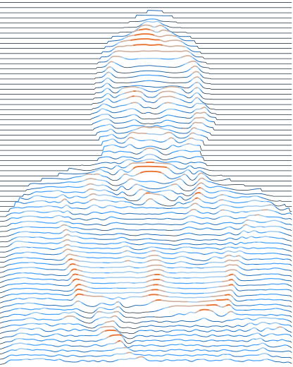

::: {.hero}

::: {}

# Mattia Piazza {.hero-name}

::: {.hero-role}
Mechatronics engineer | Software developer
:::

::: {.hero-statement}
Planning and control for vehicles that *have to work.*
:::

::: {.hero-social}
[github](https://github.com/mattiapzz)
[linkedin](https://www.linkedin.com/in/mattiapiazza/)
[scholar](https://scholar.google.com/citations?user=_csJIOYAAAAJ&hl=it&oi=ao)
[orcid](https://orcid.org/0000-0003-0182-5867)
:::

:::

```{=html}
<div class="reveal soft" data-reveal="pointer" tabindex="0" role="slider"
     aria-label="Reveal the portrait from its wave rendering"
     aria-valuemin="0" aria-valuemax="100" aria-valuenow="50">
  
  <div class="art">
    
  </div>
  <div class="seam"></div>
</div>
```

:::
