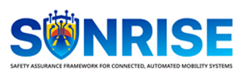

## Funded & institutional

::: {.project-list}

::: {.project-card}

::: {.project-body}
[VeDi 2025](projects/vedi.qmd){.project-title}\
CRF - Stellantis | University of Trento - Ministero Italiano dello Sviluppo Economico\
Development of a motion planner for maneuver negotiation between autonomous vehicles via V2X communication.\
[2022 - 2024]{.project-meta}
:::
:::

::: {.project-card}

::: {.project-body}
[SUNRISE](projects/sunrise.qmd){.project-title}\
Horizon Europe project | University of Trento\
Safety assUraNce fRamework for connected, automated mobIlity SystEms - a safety assurance framework for connected and automated mobility (CCAM).\
[2024 - 2025]{.project-meta}

<a href="https://ccam-sunrise-project.eu/" target="_blank" rel="noopener">Project site</a>

:::
:::

::: {.project-card}

::: {.project-body}
[Minimum Lap Time Simulator](projects/mlt.qmd){.project-title}\
Aprilia Racing | University of Trento\
Offline optimal-control minimum lap time simulator for MotoGP, with performance analysis against telemetry.\
[2021 - present]{.project-meta}
:::
:::

:::

## Personal & open-source

::: {.project-list}

::: {.project-card}
::: {.entry-icon}

:::

::: {.project-body}
[FBGA](projects/fbga.qmd){.project-title}\
Forward-Backward method for time-optimal velocity planning under generic acceleration constraints. Public C++ library, maintained solely by me. A 3D extension for spatial paths continues alongside it in [FBGA_3D](https://github.com/mattiapzz/FBGA_3D).\
[2025 - present]{.project-meta}

<a href="https://doi.org/10.1109/LRA.2025.3643297" target="_blank" rel="noopener">Paper</a>
<a href="https://github.com/DRIVEWISE/FBGA" target="_blank" rel="noopener">Code</a>

:::
:::

::: {.project-card}
::: {.entry-icon}

:::

::: {.project-body}
[VehiclePrimitives](projects/vehicle-primitives.qmd){.project-title}\
Vehicle motion primitives and the MPTreeRRT planner, a sampling-based motion planner built on the MPTree publication, for generating feasible trajectories for cars, trucks, and autonomous robots.

<a href="https://doi.org/10.1016/j.ifacol.2024.07.332" target="_blank" rel="noopener">Paper</a>
<a href="https://github.com/mattiapzz/VehiclePrimitives" target="_blank" rel="noopener">Code</a>

:::
:::

::: {.project-card}
::: {.entry-icon}

:::

::: {.project-body}
[geographic_coordinates](projects/geographic-coordinates.qmd){.project-title}\
Conversion library between geodetic, Earth-Centered-Earth-Fixed (ECEF), and local East-North-Up (ENU) frames on the WGS84 ellipsoid - the standard way to turn raw GNSS fixes into a usable local frame.

<a href="https://github.com/mattiapzz/geographic_coordinates" target="_blank" rel="noopener">Code</a>

:::
:::

::: {.project-card}
::: {.entry-icon}

:::

::: {.project-body}
[scope](projects/scope.qmd){.project-title}\
A browser-based CSV/TSV scope viewer for telemetry and logs - plot columns as series, XY, or XYZ. No build step, no dependencies, runs entirely client-side.

<a href="https://mattiapzz.github.io/scope/" target="_blank" rel="noopener">Demo</a>

:::
:::

::: {.project-card .soon}
::: {.entry-icon}

:::

::: {.project-body}
[Dashboard]{.project-title}\
A browser-based vehicle dashboard emulator - speed, RPM, gear and other channels rendered live, in HTML.\
[Coming soon]{.project-meta}
:::
:::

:::
