## Journals

```{=html}
<div class="pub-list">

<div class="pub-card">
  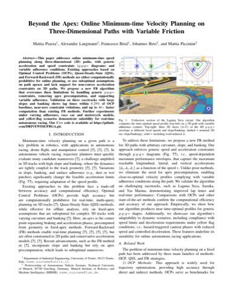
  <div class="pub-body">
    <div class="pub-title">Beyond the Apex: Online Minimum-time Velocity Planning on Three-Dimensional Paths with Variable Friction</div>
    <div class="pub-authors"><strong>M. Piazza</strong>, A. Langmann, F. Biral, J. Betz, M. Piccinini</div>
    <div class="pub-venue">IEEE Robotics and Automation Letters, 2026</div>
    <div class="pub-links"><a class="pub-badge" href="https://doi.org/10.1109/LRA.2026.3707351" target="_blank" rel="noopener">DOI</a></div>
  </div>
</div>

<div class="pub-card">
  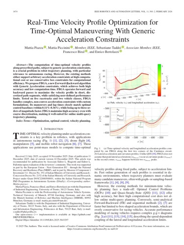
  <div class="pub-body">
    <div class="pub-title">Real-Time Velocity Profile Optimization for Time-Optimal Maneuvering With Generic Acceleration Constraints</div>
    <div class="pub-authors"><strong>M. Piazza</strong>, M. Piccinini, S. Taddei, F. Biral, E. Bertolazzi</div>
    <div class="pub-venue">IEEE Robotics and Automation Letters, vol. 11, no. 2, pp. 1674–1681, 2026</div>
    <div class="pub-links"><a class="pub-badge" href="https://doi.org/10.1109/LRA.2025.3643297" target="_blank" rel="noopener">DOI</a></div>
  </div>
</div>

<div class="pub-card">
  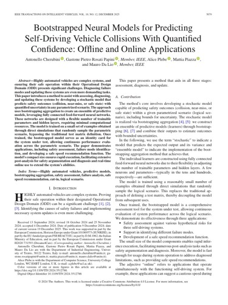
  <div class="pub-body">
    <div class="pub-title">Bootstrapped Neural Models for Predicting Self-Driving Vehicle Collisions With Quantified Confidence: Offline and Online Applications</div>
    <div class="pub-authors">A. Cherubini, G. P. Rosati Papini, A. Plebe, <strong>M. Piazza</strong>, M. Da Lio</div>
    <div class="pub-venue">IEEE Transactions on Intelligent Vehicles, 2024</div>
    <div class="pub-links"><a class="pub-badge" href="https://doi.org/10.1109/TIV.2024.3512786" target="_blank" rel="noopener">DOI</a></div>
  </div>
</div>

<div class="pub-card">
  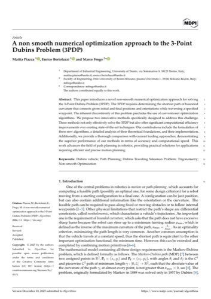
  <div class="pub-body">
    <div class="pub-title">A Non-Smooth Numerical Optimization Approach to the Three-Point Dubins Problem (3PDP)</div>
    <div class="pub-authors"><strong>M. Piazza</strong>, E. Bertolazzi, M. Frego</div>
    <div class="pub-venue">Algorithms, vol. 17, no. 8, p. 350, 2024</div>
    <div class="pub-links"><a class="pub-badge" href="https://doi.org/10.3390/a17080350" target="_blank" rel="noopener">DOI</a></div>
  </div>
</div>

<div class="pub-card">
  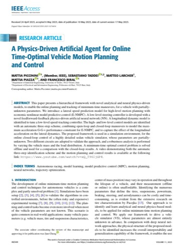
  <div class="pub-body">
    <div class="pub-title">A Physics-Driven Artificial Agent for Online Time-Optimal Vehicle Motion Planning and Control</div>
    <div class="pub-authors">M. Piccinini, S. Taddei, M. Larcher, <strong>M. Piazza</strong>, F. Biral</div>
    <div class="pub-venue">IEEE Access, vol. 11, pp. 46344–46372, 2023</div>
    <div class="pub-links"><a class="pub-badge" href="https://doi.org/10.1109/ACCESS.2023.3274836" target="_blank" rel="noopener">DOI</a></div>
  </div>
</div>

</div>
```

## Conferences

```{=html}
<div class="pub-list">

<div class="pub-card">
  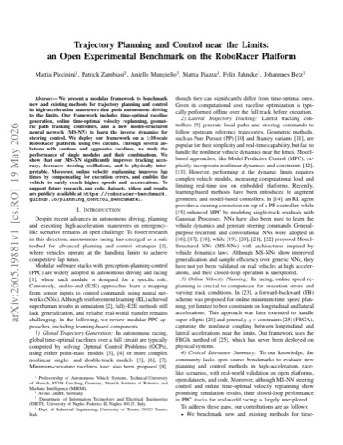
  <div class="pub-body">
    <div class="pub-title">Trajectory Planning and Control near the Limits: an Open Experimental Benchmark on the RoboRacer Platform</div>
    <div class="pub-authors">M. Piccinini, P. Zambiasi, A. Mungiello, <strong>M. Piazza</strong>, F. Jahncke, J. Betz</div>
    <div class="pub-venue">IEEE ITSC conference, 2026</div>
    <div class="pub-links"><a class="pub-badge" href="https://arxiv.org/abs/2605.19881" target="_blank" rel="noopener">arXiv</a></div>
  </div>
</div>

<div class="pub-card">
  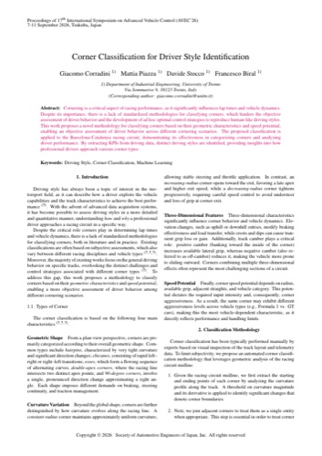
  <div class="pub-body">
    <div class="pub-title">Corner Classification for Driver Style Identification</div>
    <div class="pub-authors">G. Corradini, <strong>M. Piazza</strong>, D. Stocco, F. Biral</div>
    <div class="pub-venue">AVEC 2026 conference, 2026</div>
  </div>
</div>

<div class="pub-card">
  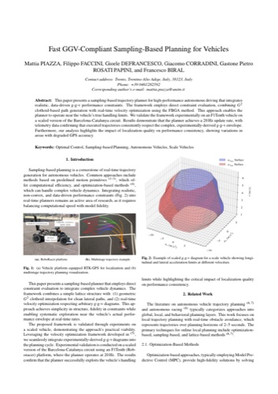
  <div class="pub-body">
    <div class="pub-title">Fast GGV-Compliant Sampling-Based Planning for Vehicles</div>
    <div class="pub-authors"><strong>M. Piazza</strong>, F. Faccini, G. Defrancesco, G. Corradini, G. P. Rosati Papini, F. Biral</div>
    <div class="pub-venue">AVEC 2026 conference, 2026</div>
  </div>
</div>

<div class="pub-card">
  <div class="pub-thumb-placeholder">AVEC 2026</div>
  <div class="pub-body">
    <div class="pub-title">Modular Motion Planner for Autonomous Vehicles in Structured and Unstructured Scenarios</div>
    <div class="pub-authors">S. Ciuffoletti, <strong>M. Piazza</strong>, G. P. Rosati Papini, F. Biral</div>
    <div class="pub-venue">AVEC 2026 conference, 2026</div>
  </div>
</div>

<div class="pub-card">
  <div class="pub-thumb-placeholder">German Robotics Conf.</div>
  <div class="pub-body">
    <div class="pub-title">FBGA: a Forward-Backward Method for Online Time-Optimal Velocity Planning with Generic Acceleration Constraints</div>
    <div class="pub-authors"><strong>M. Piazza</strong>, M. Piccinini, S. Taddei, F. Biral, E. Bertolazzi</div>
    <div class="pub-venue">Proceedings of the 2nd German Robotics Conference, Cologne, Germany, 2026 (Extended abstract)</div>
  </div>
</div>

<div class="pub-card">
  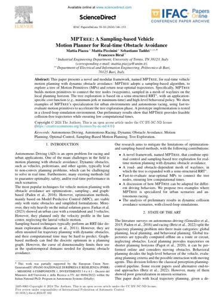
  <div class="pub-body">
    <div class="pub-title">MPTree: A Sampling-based Vehicle Motion Planner for Real-time Obstacle Avoidance</div>
    <div class="pub-authors"><strong>M. Piazza</strong>, M. Piccinini, S. Taddei, F. Biral</div>
    <div class="pub-venue">IFAC-PapersOnLine, vol. 58, no. 10, pp. 146–153, 2024</div>
    <div class="pub-links"><a class="pub-badge" href="https://doi.org/10.1016/j.ifacol.2024.07.332" target="_blank" rel="noopener">DOI</a></div>
  </div>
</div>

<div class="pub-card">
  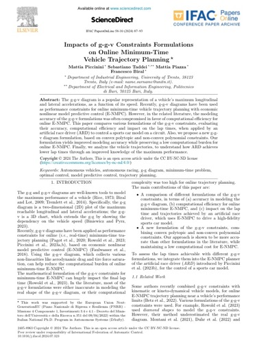
  <div class="pub-body">
    <div class="pub-title">Impacts of ggv Constraints Formulations on Online Minimum-Time Vehicle Trajectory Planning</div>
    <div class="pub-authors">M. Piccinini, S. Taddei, <strong>M. Piazza</strong>, F. Biral</div>
    <div class="pub-venue">IFAC-PapersOnLine, vol. 58, no. 10, pp. 87–93, 2024</div>
    <div class="pub-links"><a class="pub-badge" href="https://doi.org/10.1016/j.ifacol.2024.07.323" target="_blank" rel="noopener">DOI</a></div>
  </div>
</div>

</div>
```

## Workshops

```{=html}
<div class="pub-list">

<div class="pub-card">
  <div class="pub-thumb-placeholder">ICRA 2026 Workshop</div>
  <div class="pub-body">
    <div class="pub-title">Towards a Fully Differentiable Framework for Autonomous Driving Based on Model-Structured Neural Networks</div>
    <div class="pub-authors">S. Ciuffoletti, G. Defrancesco, G. Scialla, <strong>M. Piazza</strong>, S. Taddei, G. P. Rosati Papini</div>
    <div class="pub-venue">IEEE ICRA 2026 Workshop on Autonomous Driving, Wien, Austria, 2026</div>
  </div>
</div>

<div class="pub-card">
  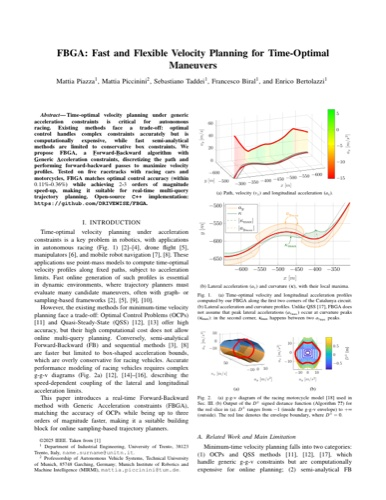
  <div class="pub-body">
    <div class="pub-title">FBGA: Fast and Flexible Velocity Planning for Time-Optimal Maneuvers</div>
    <div class="pub-authors"><strong>M. Piazza</strong>, M. Piccinini, S. Taddei, F. Biral, E. Bertolazzi</div>
    <div class="pub-venue">ICRA Workshop on Frontiers of Optimization for Robotics, 2nd Edition, 2026</div>
  </div>
</div>

<div class="pub-card">
  <div class="pub-thumb-placeholder">ICRA 2026</div>
  <div class="pub-body">
    <div class="pub-title">Nnodely – Neuralize Your Model</div>
    <div class="pub-authors">G. P. Rosati Papini, A. Plebe, M. Sharifzadeh, <strong>M. Piazza</strong>, <em>et al.</em></div>
    <div class="pub-venue">IEEE ICRA 2026, Wien, Austria, 2026 (Late breaking results)</div>
    <div class="pub-links"><a class="pub-badge" href="https://github.com/tonegas/nnodely" target="_blank" rel="noopener">Code</a></div>
  </div>
</div>

</div>
```

## Supervised theses

MS theses in Mechatronics Engineering, University of Trento, that I supervised.

- **2026** — Sabrina Ciuffoletti, *Modular Optimization-Based Motion Planner for Autonomous Agents: Application on Autonomous Vehicles in Structured and Unstructured Environments*. Supervisors: Gastone Pietro Rosati Papini, Mattia Piazza.
- **2025** — Mattia Pettene, *Development of a Motion Primitive based Planner for Autonomous Driving Applications*. Supervisors: Francesco Biral, Mattia Piazza.
- **2024** — Annachiara D'Aquilio, *Optimal Trajectory Planning for Kernels of CNC Machine Tools*. Supervisors: Enrico Bertolazzi, Paolo Bosetti, Mattia Piazza.
- **2023** — Marco Grano, *Design and Optimization of a Speed Controller for Cooperative Adaptive Cruise Control (C-ACC)*. Supervisors: Francesco Biral, Mattia Piazza, Juan Pablo Salmoiraghi.
